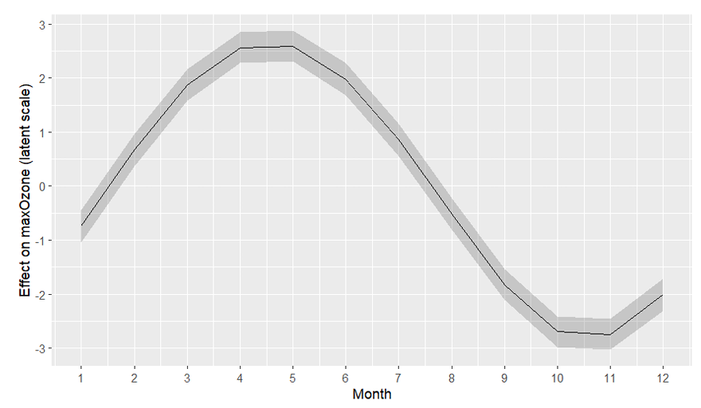
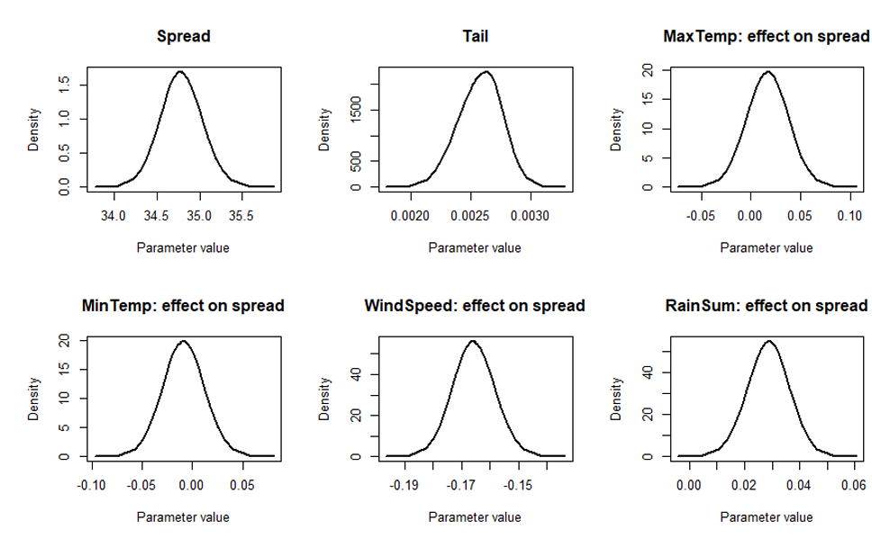
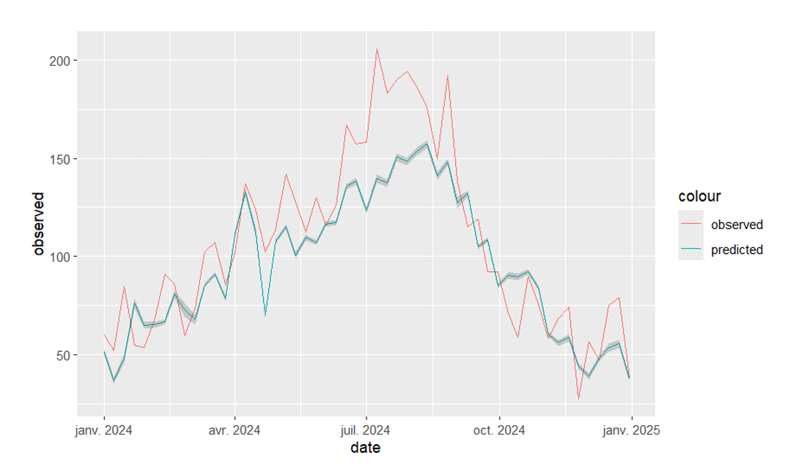

# Bayesian Modeling of Extreme Ozone Concentrations

This project focuses on the statistical modeling of maximum ozone concentrations in Lombardy using meteorological covariates.

## Overview

Air pollution is a major environmental and public health in which ozone plays a particularly important role due to its harmful effects on human health, vegetation, and ecosystems.

The main scientific objective of this project is to understand how meteorological conditions influence extreme ozone concentrations and to develop a bayesian statistical model capable of capturing this relationship in a reliable and interpretable way.

## Method

This project focuses on modeling weekly maximum ozone levels observed at different monitoring stations.

It relies on extreme value theory within a Bayesian framework through the use of the Generated Extreme Value (GEV) distribution. More precisely, we adopt a  quantile-based reparametrization of this distribution and penalized complexity priors.

The GEV distribution depends on 3 parameters: the location, the spread and the tail.

3 differents models were fitted using the INLA framework:
  - a temporal model
  - a heteroskedastic model
  - a hybrid model

A comparison between INLA and STAN implementation have also been conducted (see the report for more details).

## Data

We worked with the Arpa Lombardia dataset to obtain weekly ozone maximums for 51 monitoring stations throughout Lombardy from 2018 to 2024.

The following weekly meteorogical covariates were collected from Open-Meteo for each monitoring station:
  - Maximum temperature at 2m
  - Minimum temperature at 2m
  - Total weekly precipitation
  - Maximum wind speed at 10m

## Results

### Temporal model

In this model, the location parameter shows a linear component for the meteorogical covariates and the year and cyclic second-order random walk for the monthly seasonal component. The spread and tail parameters are covariate free.

From this model fitted on the data, we concluded that:
  - Hot conditions strongly enhance ozone concentrations.
  - Precipitations reduces ozone extremes
  - Clear annual pattern with a peak in late spring and a minimum in autumn.
  - Exponential type tail indicates extreme ozone events are rare.

<figure>

<figcaption>Figure 1: Seasonality effect on the location parameter</figcaption>
</figure>

### Heteroskedastic Model

In this model, the temporal components were removed from the location parameter, so that it only depends on meteorological covariates. The spread parameter integrate meteorigical covariates. The tail stays covariate free.

Our conclusions were:
  - Similar meteorological effect on the location parameter than the previous model. Though, the maximum temperature shows a lower effect with the
extreme behaviour now explained by variance inflation rather than a shift in the median.
  - No effect of the temperature on the dispersion of ozone value.
  - The wind tends to reduce the ozone extreme variability.
  - The precipitation tends to increase the variability while lowering the mean.

<figure>

<figcaption>Figure 2: Posterior densities of spread and tail parameters</figcaption>
</figure>

### Hybrid Model

In this model, the location depends on meteorological covariates and temporal components like in the first model. The spread parameter depends on meteorological covariates as well like in the second model. The tail parameter stays covariate free.

Our conclusions:
  - Clear seasonality pattern
  - Hot conditions strongly increase ozone maxima
  - Wind tends to stabilize the ozone extremes
  - Precipitations increase the variability but lower the mean.
  - the distribution tail is exponential.

### Limitations

The three models shows an underestimation of ozone levels during extreme peaks. This indicates that our models are too conservative. It can be explain by the use of penalized complexity priors for the tail parameter that is too strict.
 
 <figure>

<figcaption>Figure 3: Observed vs predicted weekly maximum ozone</figcaption>
</figure>

 

## Credits

Academic project conducted for the Bayesian Statistics course 2025/2026 at Politecnico di Milano.

Authors:
  - Luca Binaghi
  - Alexandre Bouvier
  - Benoît Caron
  - Maxime Dabout
  - Adam Lerondel-Touzé
  - Elias Ramili

Supervisers:
  - Simone Colombara
  - Giulio Beltramin
